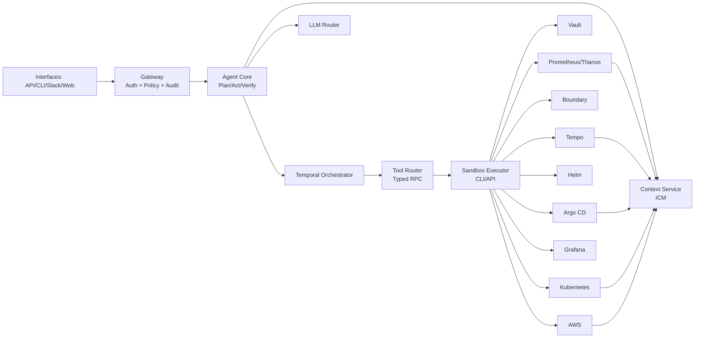
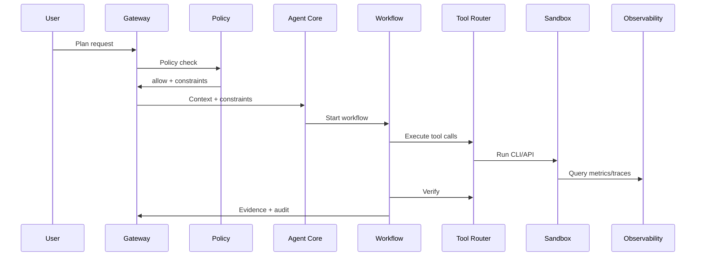

# Architecture

## Goals
- Autonomous detect -> diagnose -> plan -> act -> verify -> rollback
- Policy bounded actions, zero trust control plane
- Evidence first operations (metrics, traces, GitOps status)
- Durable workflows, resumable after crash
- Human readable memory, auditable decisions

## Constraints
- Single tenant, self hosted
- LLM must not run tools directly
- All tool actions via policy checked router + sandbox
- No secrets in logs or LLM prompt

## High level components
- Gateway: HTTP + WebSocket control plane, auth, session, policy check, audit
- Agent Core: reasoning, planning, tool selection, evidence synthesis
- Workflow Orchestrator: Temporal workflows + activities
- Tool Router: typed RPC for tool contracts, schema validation, CLI-first routing (API fallback only if CLI unavailable)
- Executor Sandbox: isolated CLI/API execution, egress allowlist
- Context Service: Infrastructure Context Model (ICM), digital twin
- Policy Service: OPA/Rego evaluation
- Audit Store: append only events + evidence pointers
- LLM Router: provider selection, prompt redaction, rate limiting
- UI/CLI/ChatOps: user surfaces

## Trust boundaries
- Gateway boundary: external users/clients -> internal services
- Tool Router boundary: input validation + policy gating
- Sandbox boundary: least privilege runtime for CLI/API
- Secrets boundary: Vault/Boundary, never returned to UI

## Architecture diagram

## Data flow: plan -> execute -> verify

## Deployment topology
- Namespace separation: `assistant-control`, `assistant-runtime`, `assistant-observe`
- Gateway + Agent Core in `assistant-control`
- Temporal + Postgres in `assistant-runtime`
- Sandbox executor in `assistant-runtime`, no hostPath by default
- NetworkPolicy: only Tool Router -> Sandbox; only Sandbox -> allowlisted egress
- Vault Agent sidecar for services needing secrets

## Non-functional requirements
- Availability: 99.5% monthly
- Plan response p95 < 10s
- Execution start p95 < 30s
- Audit write success >= 99.9%
- Evidence storage: 365 days by default

## Failure modes
- LLM timeout: fallback to cached context + minimal plan
- Tool failure: retry activity, then rollback if preconditions broken
- Policy engine down: fail closed, read only
- Context stale: force refresh, reject write actions

## Extension points
- New tool connectors via typed RPC schema
- New workflows as Temporal workflows + activities
- New policy bundles via OPA data

## ICM refresh and event ingestion
- Pollers: Argo CD apps, Helm releases, AWS resources, Grafana data sources
- Watchers: K8s resources via watch + bookmarks
- Webhooks: Alertmanager, Argo CD, Git provider
- Refresh SLA: 60s for alerts, 5m for inventory

## LLM prompt pipeline
- System prompt fixed, no tool execution rights
- Context window built from ICM + recent evidence
- Redaction pass before model call
- Output parser to extract plan steps and tool intents

## Evidence store
- Evidence stored in object store with immutable keys
- Audit events reference evidence IDs only
- UI renders evidence via signed URLs

## Risk scoring
- Risk computed from action class, scope, target count, env
- Medium/high risk auto requires approval
- Policy can override to deny or tighten constraints
